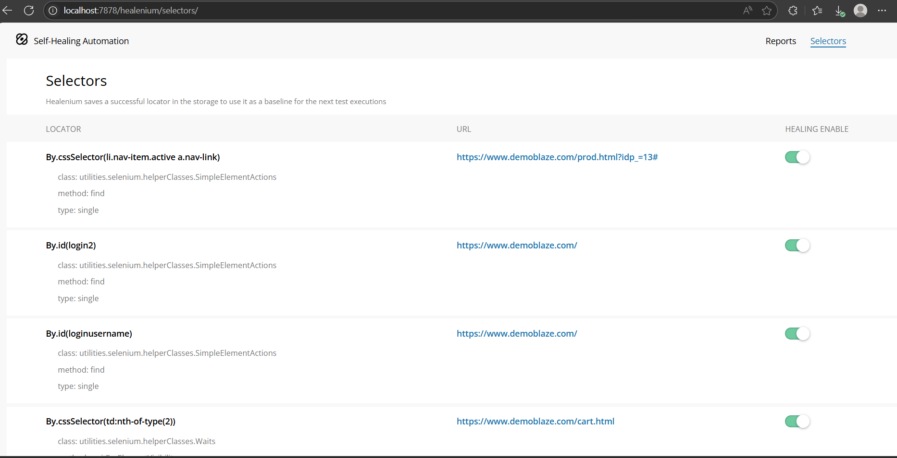
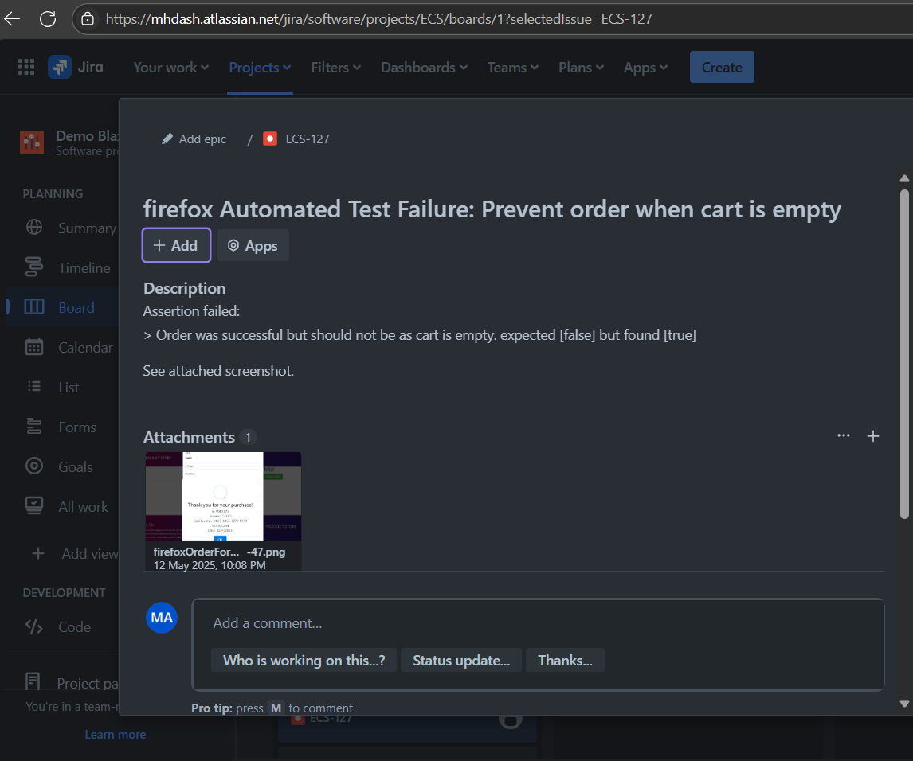
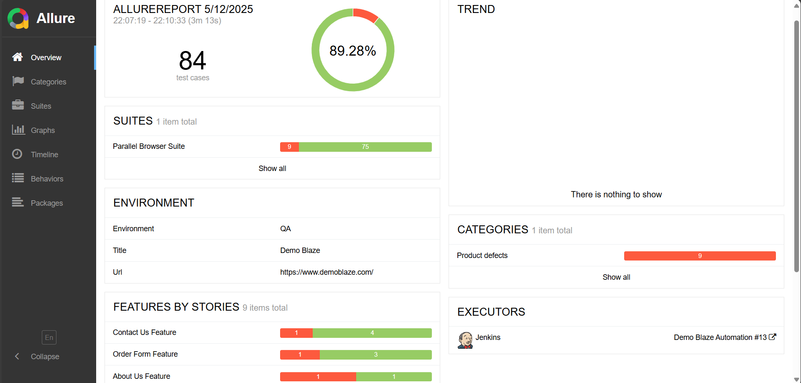

# 🧪 Demoblaze Web Automation Framework

A complete Web Automation Test Framework for [Demoblaze](https://www.demoblaze.com/) built using **Java + Selenium WebDriver + TestNG**, following Page Object Model and enriched with dynamic data-driven testing using Factories and DataProviders.

---

## 📦 Project Structure & Layered Architecture

```
demoblaze/
│
├── src/
│   ├── main/
│   │   └── java/
│   │       ├── com.demoblaze/             # Page Object classes: HomePage, CartPage, ItemPage
│   │       ├── PageComponents/            # Page components: LoginForm, OrderForm, NavBar...
│   │       ├── listeners/                 # TestNG listeners for retry logic, logging, events
│   │       └── utilities/
│   │           ├── common/                # Logging, date/time, file I/O, JIRA integration, etc.
│   │           ├── selenium/              # WebDriver factory, wait utilities, actions, alerts
│   │           └── uiElements/            # Abstract elements like Button, Link, TextField, etc.
│
│   └── test/
│       └── java/
│           ├── testclasses/
│           │   ├── e2e/                   # E2E flows (GuestBuyItems, UserBuyItems)
│           │   └── features/              # Feature-based tests: Cart, Login, ContactUs, etc.
│           ├── utils/
│           │   ├── dataproviders/        # TestNG DataProviders (CSV, Excel, Model-based)
│           │   ├── models/               # POJOs to map input test data
│           │   └── testFactories/        # TestFactory.java (Dynamic Test Instantiation)
│
├── pom.xml                               # Project dependencies (TestNG, Selenium, Allure, etc.)
├── Jenkinsfile                           # CI/CD pipeline script (Jenkins)
└── .gitignore
```

---

## 🧪 Test Execution Flow

This framework follows a **data-driven, factory-based execution model**:

### 🔄 Test Factory (`TestFactory.java`)
- Dynamically instantiates test classes with **external data** (from DataProviders).
- Uses `@Factory` to inject data into feature classes like `CartTests`, `LoginTests`, `GuestBuyItemsTest`, etc.
- Promotes **parallel execution** and **clean test isolation**.

Example:
```java
@Factory(dataProvider = "cartData", dataProviderClass = DataProviders.class)
public Object[] createCartTests(CartTestData cartData) {
    return new Object[]{ new CartTests(cartData) };
}
```

---

## ✅ Test Coverage

### ✔️ End-to-End Tests:
- `GuestBuyItemsTest` – guest adds items to cart and purchases
- `UserBuyItemsTest` – registered user completes full flow

### ✔️ Feature-based Functional Tests:
- `LoginTests` – login functionality with various scenarios
- `SignUpTests` – new user registration flow
- `CartTests` – add/remove items, verify totals
- `OrderFormTests` – input validation and submission
- `HomePageTests`- item navigation
- `ContactUsTests`,`AboutUsTests` -

---
## 🧰 Core Features

### 1. Design & Abstractions  
- **Page Object Model**  
  Maintainable, readable test logic via page abstractions.  
- **Reusable UI Components**  
  Forms, modals, buttons abstracted into standalone classes for easy reuse.  
- **Dynamic Data Injection**  
  Factory-based data injection with POJOs for flexible test data management.  
- **Input/Output Utilities**  
  Excel, CSV, JSON, and SQL support through modular readers and writers.

### 2. Browser Support
- Supports Chrome, Firefox, and Edge via flexible driver factories.

### 3. Locator Healing with Helenium Driver
- Integrated **Helenium WebDriver**, a self-healing driver that uses **machine learning** to fix broken locators during runtime.
- Learns from historical test executions to automatically detect and resolve locator issues.
- Wrapped inside the custom `DriverFactory`, seamlessly replacing the standard WebDriver without requiring test logic changes.
- Logs healing attempts and applied alternatives for transparency.
- Greatly reduces test maintenance and improves stability after UI changes.




### 4. Listeners & Test Lifecycle
- **ExecutionListener**: Centralized control over test suite setup/teardown.  
- **Retry & Result Listeners**: Automatically retries broken tests only and logs results consistently.  
- **Method-Level Hooks**: Add pre/post logic without modifying test methods.  
- **Test Isolation**: Keeps test logic focused by handling non-test concerns behind the scenes.  
- **Reusable Design**: Modular listeners work across multiple projects.

### 5. Custom Assertions
- **Soft Assertions**: Accumulates multiple failures without stopping execution.  
- **Thread-Safe & Clean**: Per-thread tracking and cleanup ensure safe execution.  
- **Integrated with TestNG**: Works seamlessly with its lifecycle.

### 6. Logging System
- **Thread-Local Logs**: Prevents log mixing in parallel runs.  
- **Allure Integration**: Attaches logs per test for better traceability.  
- **Console & File Output**: Real-time ANSI-colored logs and rolling file logs under `test_outputs/logs`.  
- **Context Routing**: Uses MDC/custom keys to separate logs per context.  
- **Standard API**: Uses Log4j2 without extra boilerplate.

### 7. Jira Integration
- **Singleton `JiraManager`**: Lazy-loaded, efficient, and centralized.  
- **Synchronous Execution**: Immediate issue creation on test failure.  
- **Unified API Layer**: Handles create, comment, and attach in one place.  
- **Auto Reporting**: `JiraReporter` listens for test failures and reports them.  
- **Rich Issue Content**: Includes method names, stack traces, and attachments.  
- **Debug-Ready**: Enhances clarity with logs, comments, and context.
  


---

## 📊 Reporting & CI/CD

- **Allure Reports**:
    ```bash
    allure serve target/allure-results
    ```



- **Jenkins Integration**:
    - Trigger test runs on every commit
    - Archive Allure reports
    - Status badges, result tracking

---

## 🧪 Configuration Management

- Test data: in `/utils/models` as POJOs
- Configuration values (browser, URL, timeouts): in `.properties` or XML files
- Browser setup: via `DriverFactory` and `WebDriverManager`

---

## ⚙️ How to Run

### Prerequisites:
- Java 11+
- Maven 3.8+
- ChromeDriver / GeckoDriver (auto-managed or manually installed)
- Allure CLI (for reporting)

### 🚀 Run Default Test Suite

By default, this will execute the **Parallel Browser Suite** (`crossBrowserTesting.xml`), which spins up **6 threads in total**—with **2 parallel threads** for each browser (Chrome, Firefox, and Edge)—maximizing cross-browser coverage and speed.

```bash
mvn clean test
```


### 🚀 Run Specific Suite :
```bash
mvn -DsuiteFile=TestRunners/SmokeTesting.xml test
```

---

## 🧠 ideas for Extension

- Cucumber for BDD workflows
- Add API layer with RestAssured
- Docker support for grid-based test runs
- Integrate BrowserStack or Selenium Grid

---

## 🧑 Author

**Mohammed Ashraf**  


---

## 📄 License

MIT License.
